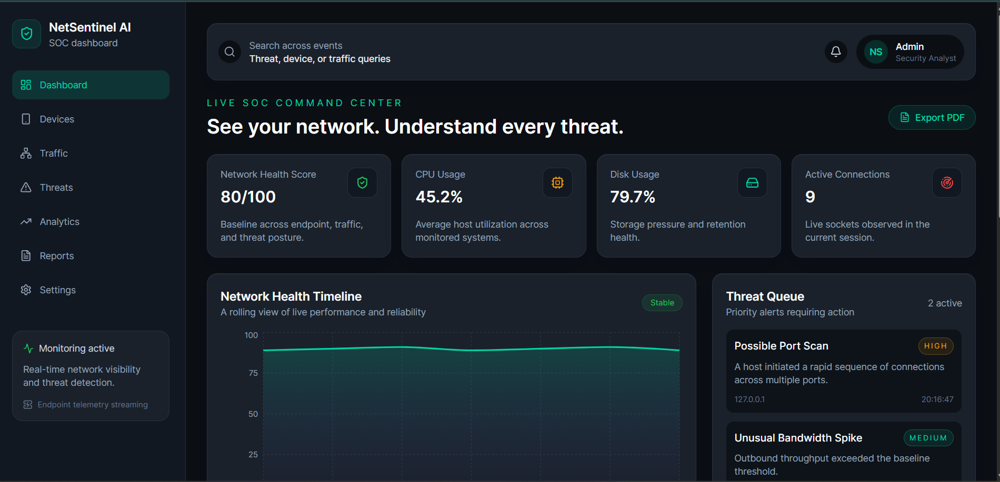
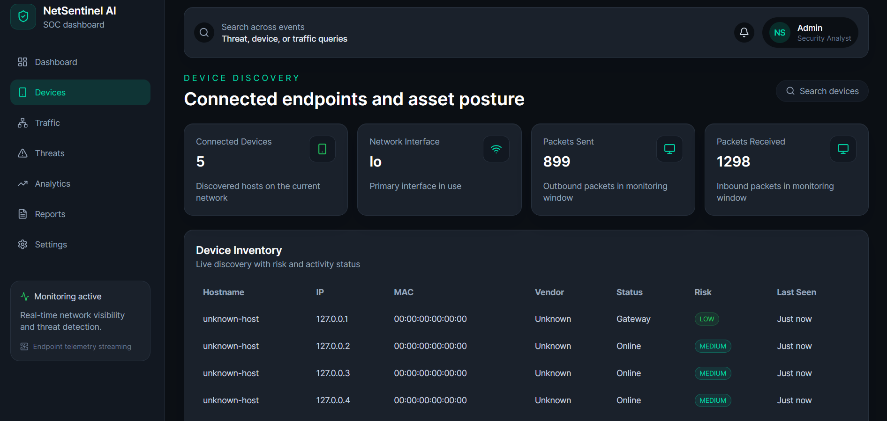
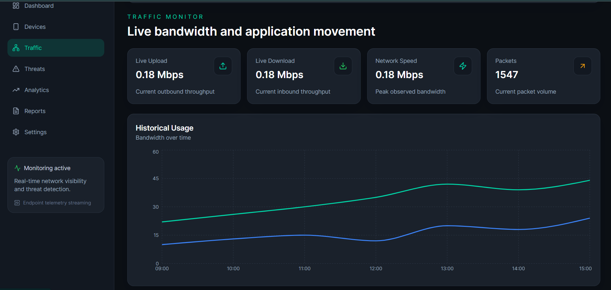
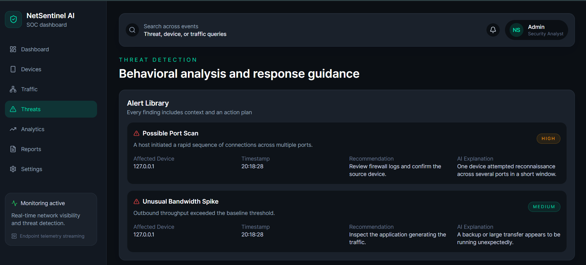
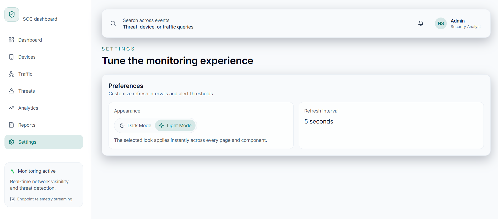
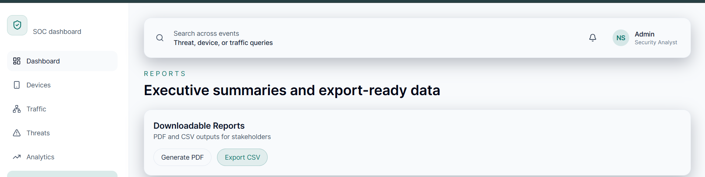

# NetSentinel 

<div align="center">




**See your network. Understand every threat.**

A full-stack SOC-style dashboard that turns raw host telemetry into a single, readable view of device inventory, traffic, and security alerts.


[Live Frontend](https://nsnl.netlify.app) · [Live API](https://nsnl-backend.onrender.com/api/telemetry) · [Local Setup](#-local-setup) · [API Reference](#-api-reference)

</div>

---

## Overview

NetSentinel AI is a portfolio-grade network monitoring dashboard built as a Flask REST API paired with a React SPA. The backend reads real system and network telemetry from the host it runs on using `psutil`, does a lightweight sweep of nearby local-network addresses, and stores security events in SQLite. The frontend polls that API every 5 seconds and renders it across seven dedicated views — Dashboard, Devices, Traffic, Threats, Analytics, Reports, and Settings — styled as a SOC (Security Operations Center) console.

It's built to demonstrate a working full-stack telemetry pipeline — real system metrics, a persisted event store, a typed REST layer, and a componentized dashboard UI — rather than to replace a production SIEM or EDR product.

## Problem Statement

Basic visibility into what's happening on a network — which hosts are active, how much bandwidth they're using, whether anything looks abnormal — is usually scattered across OS tools, router admin pages, and separate utilities with no shared view. NetSentinel AI consolidates host-level telemetry (CPU, disk, network I/O, active connections), a simple device inventory, and a security event feed into one interface, so that information can be inspected and exported from a single place instead of stitched together manually.

## Key Capabilities

| Capability | What it actually does |
|---|---|
| **Live host telemetry** | Polls the backend every 5s for real CPU%, disk%, active connection count, and packet counters via `psutil` |
| **Device inventory** | Probes nearby addresses on the host's local subnet and lists reachable hosts with hostname, IP, status, and risk tag |
| **Security event feed** | Threat cards with severity, affected device, a recommendation, and a plain-language explanation, backed by a SQLite `events` table with full CRUD |
| **Traffic & analytics views** | Recharts-driven bandwidth, protocol-mix, and top-talkers visualizations |
| **Exportable output** | One-click PDF summary (Dashboard) and CSV summary (Reports) generated entirely client-side |
| **Theming** | Fully functional dark/light mode, persisted to `localStorage` and applied globally |

## Architecture

```
┌───────────────────────────┐
│      Monitored Host        │
│  CPU · Disk · Net I/O      │
│  (read via psutil)         │
└─────────────┬──────────────┘
              │
              ▼
┌───────────────────────────┐
│        Flask Backend       │
│  app.py                    │
│  • collect_telemetry()     │
│  • discover_devices()      │
│  • detect_threats()        │
│  • SQLite events store     │
└─────────────┬──────────────┘
              │  JSON over REST
              ▼
┌───────────────────────────┐
│         REST API           │
│  GET  /api/telemetry       │
│  GET  /api/events          │
│  POST /api/events          │
│  DEL  /api/events/<id>     │
└─────────────┬──────────────┘
              │  fetch, polled every 5s
              ▼
┌───────────────────────────┐
│      React SPA (Vite)      │
│  App.jsx — layout + router │
│  theme.jsx — dark/light    │
│  Recharts · Framer Motion  │
└───────────────────────────┘
```

## Technical Workflow

1. On each request to `/api/telemetry`, Flask reads live CPU/memory/disk/network figures from `psutil`.
2. `discover_devices()` derives the host's local `/24` from its active interface and attempts a short-timeout TCP connect against the first few addresses in that range, resolving a hostname via reverse DNS where possible.
3. `detect_threats()` emits alert objects (severity, description, recommendation, explanation) when devices are present.
4. The React app seeds itself with a local mock state object on first paint, then merges in the live payload every 5 seconds via `setInterval`, so the UI never shows a blank/loading dashboard.
5. Security events raised through the UI or API are persisted to a SQLite table and can be listed or deleted through the same REST layer.
6. PDF/CSV export happens entirely in the browser — jsPDF and a Blob-based CSV writer construct files client-side from the current in-memory data; nothing is rendered server-side.

## Features

### Dashboard — Live SOC Command Center
Health score, CPU/disk usage, and active connection count as top-line stat cards, a rolling network health chart, a live threat queue, a traffic pulse chart, protocol distribution, alert distribution, and top talkers — all on one screen, with a working **Export PDF** action.


### Device Discovery
Lists hosts found on the local subnet with hostname, IP, MAC, vendor, status, risk tag, and last-seen time in a sortable table, alongside packet in/out counters and the active network interface.



### Traffic Monitor
Live upload/download/peak-bandwidth stat cards plus a historical usage chart tracking upload and download trends over the session.



### Threat Detection
An alert library where every finding is expanded into affected device, timestamp, a recommended action, and a plain-language explanation — designed to read like analyst triage notes rather than a raw log line.



### Settings & Theming
A fully working dark/light mode toggle that repaints every page instantly and persists across sessions via `localStorage`.



### Reports
Executive-facing export screen with a working **Export CSV** action that writes a summary of the current session's key metrics.



## API Reference

Base URL: `https://nsnl-backend.onrender.com` (production) or `http://127.0.0.1:5000` (local).

| Method | Endpoint | Description |
|---|---|---|
| `GET` | `/api/telemetry` | Returns current host telemetry, discovered devices, active alerts, and chart-ready series |
| `GET` | `/api/events` | Returns all stored security events, most recent first |
| `POST` | `/api/events` | Creates a security event from a JSON body |
| `DELETE` | `/api/events/<event_id>` | Deletes a stored event by id |

<details>
<summary><strong>Example — <code>GET /api/telemetry</code> response shape</strong></summary>

```json
{
  "healthScore": 92,
  "liveMetrics": {
    "cpu": 41.2,
    "ram": 63.8,
    "disk": 71.4,
    "uploadSpeed": 0.18,
    "downloadSpeed": 0.18,
    "packetsSent": 899,
    "packetsReceived": 1298,
    "connections": 9,
    "interface": "lo",
    "bandwidth": 0.18
  },
  "devices": [
    { "hostname": "unknown-host", "ip": "127.0.0.1", "mac": "00:00:00:00:00:00",
      "vendor": "Unknown", "status": "Gateway", "lastSeen": "Just now", "risk": "Low" }
  ],
  "alerts": [
    { "severity": "High", "title": "Possible Port Scan", "device": "127.0.0.1",
      "description": "A host initiated a rapid sequence of connections across multiple ports.",
      "recommendation": "Review firewall logs and confirm the source device.",
      "insight": "One device attempted reconnaissance across several ports in a short window.",
      "timestamp": "20:18:28" }
  ],
  "history": [{ "time": "1m", "score": 90 }],
  "trafficTimeline": [{ "time": "09:00", "upload": 10, "download": 22 }],
  "protocols": [{ "name": "TCP", "value": 48 }],
  "topTalkers": [{ "device": "laptop-01", "ip": "192.168.1.12", "bytes": 180, "risk": "Medium" }]
}
```

</details>

<details>
<summary><strong>Example — creating an event</strong></summary>

```bash
curl -X POST https://nsnl-backend.onrender.com/api/events \
  -H "Content-Type: application/json" \
  -d '{
        "title": "Manual Review",
        "severity": "Low",
        "description": "Analyst-flagged host for follow-up.",
        "device": "192.168.1.24",
        "recommendation": "Monitor for 24h.",
        "insight": "No automated signal triggered; manual flag."
      }'
```

</details>

## Tech Stack

| Layer | Technology |
|---|---|
| Frontend framework | React 18, Vite 5 |
| Routing | React Router 6 |
| Styling | Tailwind CSS 3, CSS custom properties for theming |
| Charts | Recharts |
| Motion | Framer Motion |
| Icons | lucide-react |
| Client-side export | jsPDF (PDF), Blob API (CSV) |
| Backend framework | Flask 3, Flask-CORS |
| System telemetry | psutil |
| Data store | SQLite (stdlib `sqlite3`) |
| Frontend hosting | Netlify |
| Backend hosting | Render |

> `requirements.txt` also declares `scapy`, `python-nmap`, `speedtest-cli`, and `python-whois` for deeper packet/network analysis. These are installed but not yet called from `app.py` — device discovery currently runs on plain TCP `connect()` probes rather than ARP/ICMP scanning. See [Roadmap](#-roadmap).

## Project Structure

```
NetSentinel/
├── backend/
│   ├── app.py                # Flask app: telemetry, device discovery, events API
│   ├── requirements.txt
│   └── database/
│       └── netsentinel.db    # SQLite store, created/opened at runtime
│
└── frontend/
    ├── index.html
    ├── vite.config.js        # dev server + /api proxy to localhost:5000
    ├── tailwind.config.js
    ├── postcss.config.js
    └── src/
        ├── main.jsx           # app entry, router + theme provider
        ├── App.jsx            # layout, navigation, and all 7 dashboard views
        ├── theme.jsx          # dark/light ThemeContext, persisted to localStorage
        └── index.css
```

## Local Setup

**Requirements:** Python 3.x, Node.js 18+

**Backend**

```bash
cd backend
python -m venv .venv
.venv\Scripts\activate        # Windows
# source .venv/bin/activate   # macOS/Linux

pip install -r requirements.txt
python app.py                 # serves on http://127.0.0.1:5000
```

**Frontend** — in a second terminal:

```bash
cd frontend
npm install
npm run dev                   # serves on http://localhost:5173
```

> **Note:** the frontend currently calls the deployed Render URL directly inside `App.jsx` rather than a relative `/api` path, so a local run will still pull production telemetry by default. To point it at your local backend, change the `fetch` target to `/api/telemetry` (the Vite dev server already proxies `/api` → `127.0.0.1:5000`) or introduce a `VITE_API_URL` environment variable.

## Deployment

The live instances are deployed as two independent services with no infrastructure-as-code checked into the repo — build settings are configured directly in each platform's dashboard:

- **Frontend → Netlify:** base directory `frontend`, build command `npm run build`, publish directory `frontend/dist`.
- **Backend → Render:** root directory `backend`, build command `pip install -r requirements.txt`, start command `python app.py`. Render injects `PORT`, which `app.py` already reads via `os.environ.get("PORT", 5000)`.

## Limitations

This project is intentionally scoped as a portfolio build, not a production security tool. Documented honestly, from the current implementation:

- **Device discovery is shallow.** It probes only a handful of addresses in the host's local `/24` via a short-timeout TCP connect, not a full subnet or ARP sweep. MAC address and vendor are placeholder values, not resolved from real ARP data.
- **Threat detection is template-based.** The two alert types (`Possible Port Scan`, `Unusual Bandwidth Spike`) are emitted whenever any device is discovered — they are not derived from actual traffic analysis or anomaly scoring, and the "AI Explanation" text is static, not model-generated.
- **Bandwidth figures are cumulative, not a live rate.** `Live Upload`/`Live Download` are computed from `psutil`'s cumulative byte counters since host boot, not a differential sample over a time window — so the numbers don't represent instantaneous throughput.
- **Health-score history is synthetic.** The Network Health Timeline is generated by a fixed formula on each request rather than backed by persisted time-series data.
- **Reports → Generate PDF is a stub.** It's present in the UI but not wired to a handler; PDF export currently only works from the Dashboard's Export PDF action. Export CSV on the Reports page does work.
- **Settings → Refresh Interval is a static label**, not an adjustable control; the actual 5-second poll interval is hardcoded in the frontend.
- **No authentication.** All API endpoints are open with no access control.
- **The frontend's telemetry fetch is hardcoded** to the deployed Render URL rather than an environment-driven base URL.

## Roadmap

- Wire `scapy` / `python-nmap` into `discover_devices()` for real ARP-based MAC/vendor resolution and a full subnet sweep
- Replace static alert templates with threshold- or model-based anomaly detection using real historical baselines
- Differential bandwidth sampling (delta between two counter reads over an interval) instead of cumulative-counter display
- Persist telemetry history to SQLite/time-series storage instead of a per-request synthetic formula
- Environment-driven API base URL (`VITE_API_URL`) instead of a hardcoded production endpoint
- Authentication and role-based access control on the API
- Wire the Settings page's refresh interval and alert thresholds to real, adjustable state
- Complete the Reports page's PDF export handler
- Containerize the backend and add CI for both services

## Author

**Mumtaz Fatima** — CSE (AI & ML) Student
