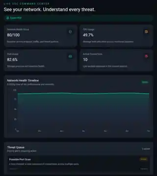
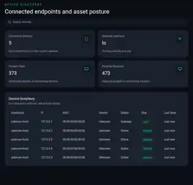
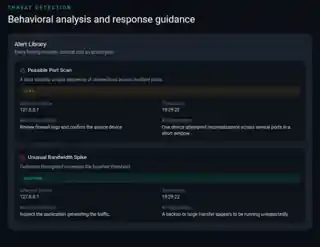
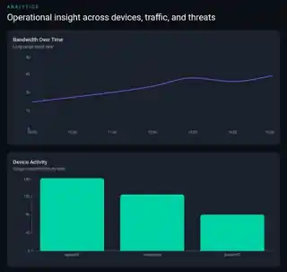
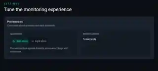

# NetSentinel AI 🛡️

> **See your network. Understand every threat.**

**NetSentinel AI** is a full-stack cybersecurity monitoring platform that combines **endpoint telemetry, device discovery, network activity, security events, analytics, and reporting** inside a SOC-style interface.

Instead of treating monitoring as a collection of disconnected metrics, NetSentinel is designed around an analyst workflow:

> **Observe → Identify → Investigate → Respond**

The project combines a Python/Flask monitoring backend with a React dashboard to turn low-level system and network signals into readable security views.

---

## ✦ The Problem

Security telemetry can quickly become difficult to interpret when system health, connected devices, network traffic, and security findings live in separate places.

NetSentinel brings these signals into one operational interface so an analyst can answer:

- **What is happening on the monitored system?**
- **Which endpoints are visible?**
- **How is network traffic changing?**
- **Which events require investigation?**
- **What context or response guidance is available?**

---

## 🧭 Product at a Glance

| Module | Purpose |
|---|---|
| 🖥️ **Dashboard** | Network health, system telemetry, active connections and threat queue |
| 🔎 **Devices** | Endpoint discovery, IP/MAC information, status and risk indicators |
| 📡 **Traffic** | Upload/download activity, packet volume and bandwidth history |
| 🚨 **Threats** | Security findings with severity, context and response guidance |
| 📊 **Analytics** | Visual analysis of network and device activity |
| 📄 **Reports** | PDF/CSV-oriented reporting workflow |
| ⚙️ **Settings** | Appearance and monitoring preferences |

---

# 🖥️ Product Showcase

> **The deployed interface, documented module by module.**

The interface is organized around a lightweight SOC workflow — moving from system visibility to investigation context instead of presenting isolated metrics.

### Dashboard + Device Discovery

| Network Operations Center | Endpoint Visibility |
|---|---|
|  |  |
| **Network health, telemetry, active connections and threat queue.** | **Connected endpoints, interfaces, packet counts and asset posture.** |

### Traffic + Threat Detection

| Traffic Monitoring | Threat Investigation |
|---|---|
|  |  |
| **Bandwidth movement, upload/download activity and packet trends.** | **Severity, affected device, timestamp, recommendation and explanation.** |

### Analytics + Reporting

| Operational Analytics | Reporting |
|---|---|
|  |  |
| **Trend-oriented views for monitoring activity.** | **Export-oriented PDF and CSV workflow.** |

### Monitoring Preferences

> **Appearance and refresh controls can be configured from the monitoring settings.**

---

# 🚨 Threat Detection

The threat module is designed to provide more context than a simple alert counter.

Current example findings include:

### Possible Port Scan
Rapid connection attempts across multiple ports.

**Context exposed**
- affected device
- timestamp
- severity
- investigation recommendation
- explanatory context

### Unusual Bandwidth Spike
Outbound throughput exceeding a monitored baseline.

**Context exposed**
- affected device
- timestamp
- severity
- investigation recommendation
- explanatory context

The goal is to turn raw telemetry into an investigation starting point: identify the signal, understand its context, and decide what deserves attention.

---

# ⚙️ How It Works

~~~
┌──────────────────────────────┐
│        Monitored Host        │
│  CPU • Disk • Network • OS   │
└──────────────┬───────────────┘
               │
               ▼
┌──────────────────────────────┐
│    Telemetry & Discovery     │
│   psutil • Scapy • nmap      │
└──────────────┬───────────────┘
               │
               ▼
┌──────────────────────────────┐
│        Flask Backend         │
│ Collection • Processing      │
│ Events • Device Discovery    │
└──────────────┬───────────────┘
               │
               ▼
┌──────────────────────────────┐
│          REST API            │
│ Telemetry • Security Events  │
└──────────────┬───────────────┘
               │
               ▼
┌──────────────────────────────┐
│         React SOC UI         │
│ Devices • Traffic • Threats  │
│ Analytics • Reports          │
└──────────────────────────────┘
~~~

---

# 🏗️ Architecture

~~~
                         NETSENTINEL
                              │
                ┌─────────────┴─────────────┐
                │                           │
                ▼                           ▼
       ┌─────────────────┐        ┌─────────────────┐
       │  System Signals │        │ Network Signals │
       │ CPU / Disk / OS │        │ Packets / Ports │
       └────────┬────────┘        └────────┬────────┘
                │                          │
                └────────────┬─────────────┘
                             ▼
                  ┌─────────────────────┐
                  │ Telemetry Layer     │
                  │ psutil / Scapy /    │
                  │ python-nmap         │
                  └──────────┬──────────┘
                             ▼
                  ┌─────────────────────┐
                  │ Flask Backend       │
                  │ Processing + Events │
                  │ SQLite Persistence  │
                  └──────────┬──────────┘
                             ▼
                  ┌─────────────────────┐
                  │ REST API            │
                  └──────────┬──────────┘
                             ▼
                  ┌─────────────────────┐
                  │ React + Vite        │
                  │ SOC Dashboard       │
                  └─────────────────────┘
~~~

---

# 🧠 Engineering Deep Dive

## Frontend

- **React** — component-based application architecture
- **Vite** — development and build tooling
- **Tailwind CSS** — responsive interface styling
- **Recharts** — telemetry and network visualizations
- **Framer Motion** — interface motion and transitions

## Backend

- **Python**
- **Flask**
- **Flask-CORS**
- REST API endpoints
- Event persistence with **SQLite**

## Monitoring & Network Layer

| Technology | Role |
|---|---|
| **psutil** | CPU, disk, interface, socket and system telemetry |
| **Scapy** | Packet/network analysis capabilities |
| **python-nmap** | Network/device discovery |
| **SQLite** | Local persistence for security events |

## Deployment

- **Frontend:** Netlify
- **Backend:** Render

---

# 📡 API Surface

The API forms the contract between telemetry collection, event persistence, and the React client.

| Method | Endpoint | Purpose |
|---|---|---|
| <code>GET</code> | <code>/api/telemetry</code> | Retrieve current telemetry |
| <code>GET</code> | <code>/api/events</code> | Retrieve stored security events |
| <code>POST</code> | <code>/api/events</code> | Create a security event |
| <code>DELETE</code> | <code>/api/events/&lt;event_id&gt;</code> | Remove a stored event |

The API keeps the frontend decoupled from the underlying monitoring and persistence layer.

---

# 📁 Project Structure

~~~
NetSentinel/
│
├── frontend/
│   ├── React + Vite application
│   ├── Dashboard modules
│   ├── Charts and visualizations
│   └── UI components
│
├── backend/
│   ├── Flask API
│   ├── Telemetry collection
│   ├── Network/device discovery
│   ├── Security event handling
│   └── SQLite persistence
│
├── docs/
│   └── screenshots/
│
└── README.md
~~~

---

# 🚀 Run Locally

## 1. Clone the repository

~~~
git clone https://github.com/MumtazFatima-08/NetSentinel.git
cd NetSentinel
~~~

## 2. Start the backend

~~~
cd backend
python -m venv .venv
~~~

### Windows PowerShell

~~~
.venv\Scripts\Activate.ps1
~~~

Then:

~~~
pip install -r requirements.txt
python app.py
~~~

## 3. Start the frontend

Open a second terminal:

~~~
cd frontend
npm install
npm run dev
~~~

The frontend can then communicate with the local Flask API according to the project's environment configuration.

---

# 🌐 Live Deployment

| Service | Link |
|---|---|
| **Frontend** | https://nsnl.netlify.app/ |
| **Backend API** | https://nsnl-backend.onrender.com |

---

# 🔐 Security & Scope

NetSentinel is a **portfolio-grade cybersecurity monitoring project** and is not intended to replace a production SIEM, EDR, NDR or enterprise SOC platform.

Actual monitoring visibility depends on:

- operating system
- network interfaces
- local permissions
- network environment
- available telemetry
- current detection logic

The project is intended to demonstrate how system and network signals can be collected, processed, persisted and presented through a security-focused interface.

---

# 🔮 Future Engineering

The roadmap focuses on increasing detection depth and operational usefulness rather than adding UI features for their own sake.

Planned directions include:

- Real-time packet capture and deeper packet inspection
- SIEM-style event correlation
- Configurable detection and alert rules
- Authentication and role-based access control
- Historical telemetry storage
- More advanced anomaly detection
- Threat-intelligence enrichment
- Alert deduplication and correlation
- Analyst-focused investigation timelines

---

# 🎯 Engineering Focus

~~~
Operating System
      ↓
System / Network Telemetry
      ↓
Python Security Processing
      ↓
REST API
      ↓
React Visualization
      ↓
Analyst Investigation Workflow
~~~

NetSentinel demonstrates **Python engineering, networking, cybersecurity concepts, API design, data persistence, and full-stack integration** — not only frontend development.

---

# 👤 Author

Built and documented by **Mumtaz Fatima**.

CSE (AI & ML) · AI & Cybersecurity

[GitHub](https://github.com/MumtazFatima-08) · [LinkedIn](https://www.linkedin.com/in/mumtaz-fatima-112366325/)

---

### 🛡️ NetSentinel AI

**See your network. Understand every threat.**

